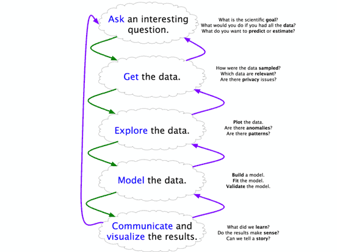
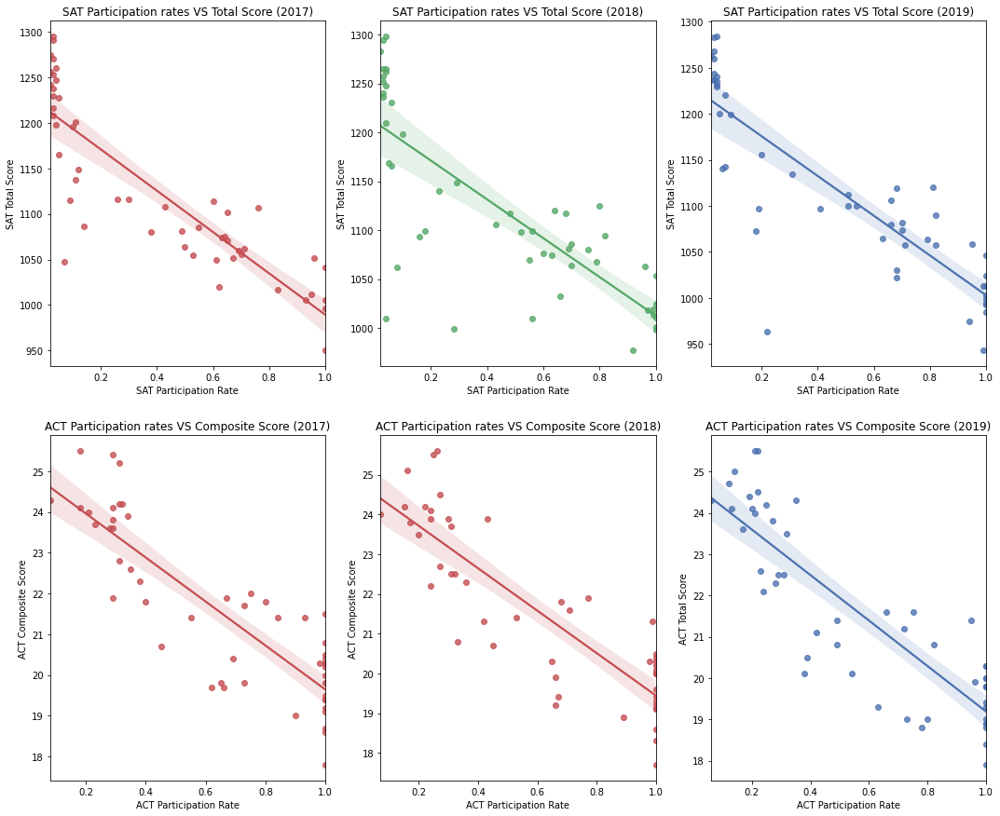
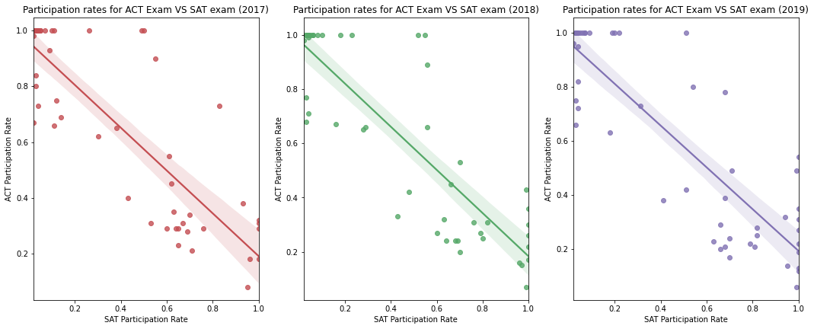
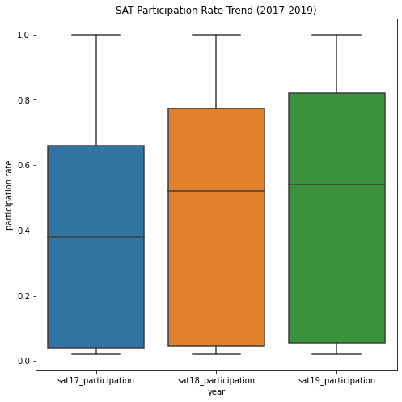
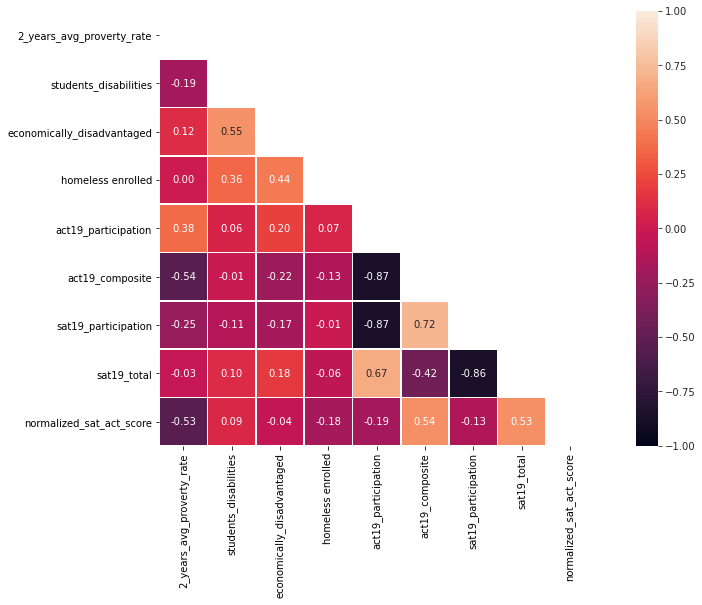
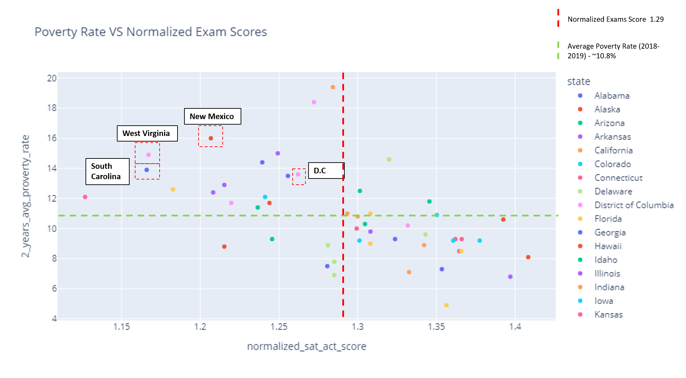
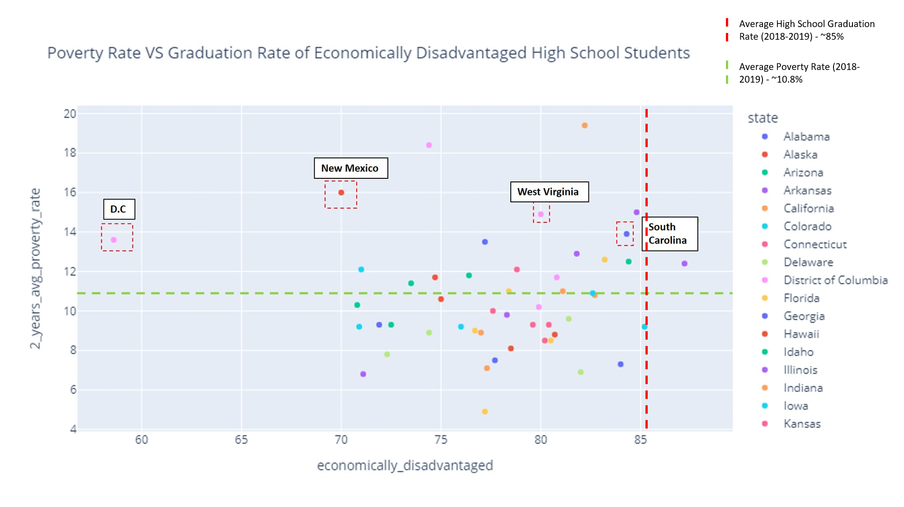

# A study on relative influences of socioeconomic status on SAT and ACT scores

## Content
 - [Problem Statement](#Problem-Statement)
 - [Executive Summary](#Executive-Summary)
 - [Datasets](#Datasets)
 - [Data Dictionary](#Data-Dictionary)
 - [Significant Findings](#Significant-Findings)
 - [Funding Recommendations](#Funding-Recommendations)
 - [Funding Strategies](#Funding-Strategies)
 - [Conclusion](#Conclusion)
 - [Citation and Sources](#Citation-and-Sources)
 ---

## Problem Statement
As advisers to the US Department of Education, we are tasked to analyze the relative influences of socioeconomic status on SAT and ACT scores in each state and make recommendations for appropriate funding measures to ensure that all states have equal educational chances. We will approach this analysis by identifying yearly trends of SAT/ ACT participation and scores from 2017 to 2019, and later study the effects of how US socioeconomic status impacts the performance in these national exams.

---
## Executive Summary   

**BACKGROUND INFO**

The SAT and ACT are standardized tests that many colleges and universities in the United States require for their admissions process. This score is used along with other materials such as grade point average (GPA) and essay responses to determine whether or not a potential student will be accepted to the university.

The SAT has two sections of the test: Evidence-Based Reading and Writing and Math. The ACT has 4 sections: English, Mathematics, Reading, and Science, with an additional optional writing section.

Aside from being a standardized college entrance exam, SAT and ACT scores are also used to compare schools and states on the basis of their national average exam score and to evaluate state educational programs. A variety of factors can influence how well high school students perform in these national exams.

Academic and institutional factors influence national exam scores at the state level. High schools with high historical SAT and ACT average scores tend to have lower teacher-to-students ratio, and thus, students benefit from receiving targeted attention which results in better exam scores. The rigorous curriculum and high-achieving educational environment appear to benefit the students since they are able to fully develop their potential, abilities, and strategies for taking the national exams ([*source0*](https://education.seattlepi.com/factors-influencing-sat-scores-2589.html)).

At the individual level, socioeconomic status may also play a significant role in determining how well a student performs in these national exams. Low-income students may struggle not only to maintain consistent attendance in school where they can continuously learn, but they may also lack adequate materials to help them prepare for the exam ([*source0*](https://education.seattlepi.com/factors-influencing-sat-scores-2589.html)). Because their parents may not have attended college themselves, these students are also less likely to receive encouragement, motivation, and support to perform well in these exams.

In this study, we will study the yearly trends of SAT and ACT national exams for a period of 3 years from 2017 to 2019, and identify states that have performed consistently poorly. Next, we will analyze the relative influences of socioeconomic status on SAT and ACT results in each state and make recommendations for appropriate funding measures to ensure that all states have equal educational chances.

**METHODOLOGY**

Following Blitzstein & Pfister’s workflow ([*source9*](https://github.com/cs109/2015/blob/master/Lectures/01-Introduction.pdf)), a 5 Steps framework was implemented to conduct this analysis. These 5 steps are:

1) Ask an interesting question
- Defining a clear and concise problem statement.

2) Get the data
- Import and clean raw data to ensure that all datatypes were accurate and any other errors were fixed.

3) Explore the data
- Perform exploratory data analysis to determine any meaningful correlation between parameters to address problem statement.

4) Model the data
- heat map
- subplots
- histograms
- scatterplots
- boxplots
- interactive maps

5) Communicate and visualize the results
- Present findings to a non-technical audience and provide recommendations

---
## Datasets

* [`act_2017.csv`](./data/act_2017.csv): 2017 ACT Scores by State
* [`act_2018.csv`](./data/act_2018.csv): 2018 ACT Scores by State
* [`act_2019.csv`](./data/act_2019.csv): 2019 ACT Scores by State
* [`sat_2017.csv`](./data/sat_2017.csv): 2017 SAT Scores by State
* [`sat_2018.csv`](./data/sat_2018.csv): 2018 SAT Scores by State
* [`sat_2019.csv`](./data/sat_2019.csv): 2019 SAT Scores by State
* [`AvgPoverty(2018-2019).xlsx`](./data/AvgPoverty(2018-2019).xlsx): Poverty rate by State in the year 2018-2019
* [`ACGR(2018-2019).xls`](./data/ACGR(2018-2019).xls): Public high school Adjusted Cohort Graduation rate (ACGR) of selected student characteristics (Economically disadvantaged, Homeless and Disabled) by State in the year 2018-2019

---
## Data Dictionary
|Feature|Type|Dataset|Description|
|---|---|---|---|
|**state**|*string*| SAT / ACT | A state is a constituent political entity in America, of which there are currently 51 in this dataset.|
|**sat_participation**|*float*| SAT_XX | Percentage of high school students who took the SAT Test in each State on Year XX |
|**sat_ebrw**|*int*| SAT_XX | Mean score for SAT Evidence-Based Reading and Writing in Year XX in each State on Year XX |
|**sat_math**|*int*| SAT_XX | Mean score for SAT Math in each State on Year XX |
|**sat_total**|*int*| SAT_XX | Total score for SAT Test in each State on Year XX |
|**act_participation**|*float*| ACT_XX | Percentage of high school students who took the ACT Test in each State on Year XX |
|**act_english**|*float*| ACT_XX | Mean score for ACT English in each State on Year XX |
|**act_math**|*float*| ACT_XX | Mean score for ACT Math in each State on Year XX |
|**act_reading**|*float*| ACT_XX | Mean score for ACT Reading in each State on Year XX |
|**act_science**|*float*| ACT_XX | Mean score for ACT Science in each State on Year XX |
|**act_composite**|*float*| ACT_XX | Mean score for ACT Composite in each State on Year XX |
|**graduatation_rate(2018-2019)**|*float*| economical_summary(2018-2019) | Average high school graduation rate in each State for the Year 2018-2019 |
|**2_years_avg_proverty_rate**|*float*| economic_summary(2018-2019) | Average poverty rate in each State for the Year 2018-2019 |
|**students_disabilities**|*float*| economic_summary(2018-2019) | **ACGR for high school students with disabilities/1/ for the Year 2018-2019 |
|**economically_disadvantaged**|*float*| economic_summary(2018-2019) | ACGR for high school students who are economically disadvantaged/2/ for the Year 2018-2019 |
|**homeless_enrolled**|*float*| economic_summary(2018-2019) | ACGR for high school students who are homeless for the Year 2018-2019 |

*ACGR - Adjusted cohort graduation rate for high school student

/1/ Students identified as children with disabilities under the Individuals with Disabilities Education Act (IDEA).

/2/ Students who met the state criteria for classification as economically disadvantaged.

---
## Significant Findings

- Strong inverse correlation (-0.86) between ACT composite score and ACT participation rate; higher ACT participation rate is related to lower ACT composite score.

- Similar inverse correlation (-0.87) is observed between SAT total score and SAT participation rate; higher SAT participation rate tend is related to lower SAT total score

A possible explanation for observed trends: These inverse correlations between participation rate and exam scores are expected as statewide adoption of SAT/ACT exam means greater participation of students of different social-economic status, cohort differences, and academic achievements ([*source2*](https://www.act.org/content/dam/act/unsecured/documents/Statewide-Adoption.pdf)). College students who are not motivated to go to college will have to equally take the national exams.
 As a result, an increasing percentage of low/mid-tier students lower the overall state average with statewide adoption of ACT/SAT ([*source3*](https://medium.com/@james.dargan/participation-skews-state-averages-f68969371a01)). Conversely, lower participation rate tend to have high exam score as self-selected elite students choose to pursue admission to elite universities voluntarily.

- Strong inverse correlation between ACT participation rate and SAT participation rate which is logically sound as college pre-requisite only require students to take either ACT or SAT exam and not both.

- SAT Participation rates have shown min, median, and interquartile (25%,75%) rates are increasing year over year. This seems logical as more and more states make it mandatory for high school students to sit for the SAT exam during recent years ([*source4*](https://blog.prepscholar.com/which-states-require-the-sat)). Conversely, ACT participation rates have shown min, median, and interquartile (25%) rates are consistently decreasing year over year. Logically it is understandable for ACT participation in the state to decrease if most of the high school students are taking SAT exams instead.

- Moderate inverse correlation (-0.53) between 2019 normalized exam scores and poverty rate; lower normalized exam scores tend to mean higher poverty rate at that given state. Poverty is defined as not having enough income to meet basic needs, such as housing, food, clothing, and healthcare. Logically, it makes sense for a state with a large percentile of population in poverty to perform worst in national exams as parents spent less on enrichment classes for their children. Additionally, parents lack the adequate skill to guide their children in proper career planning which results in a vicious cycle when these children start a family of their own. The lack of proper teaching materials, lack of a standardized test system for international use creates a gap between learning achievement and what is required by society ([*source5*](https://www.grin.com/document/384366)).

- Moderate direct correlation (0.36) is observed between the graduation rate of economically disadvantaged high school students VS graduation rate of homeless students enrolled.

- Moderate direct correlation (0.55) is observed between the graduation rate of economically disadvantaged high school students VS graduation rate of students with disabilities for the year 2018-2019.

- The graduation rate of high school students were 85.24% for the year of 2018-2019, majority of the states have economically disadvantaged students graduation rate lower than this (Even 75% quartile have only 81.9% graduation rate, which is ~4% lower than the overall high school students).

We have seen a moderate direct correlation (Point 6) between ACGR of economically disadvantaged students VS ACGR of homeless students enrolled and students with disabilities (Point 7), these are important factors to consider funding strategies for the different states.

- Comparing the subject test scores for both SAT and ACT exams, it is observed that students tend to do worst in math for both ACT and SAT exams relative to other subjects. Aside from math, students who took the ACT exam did worst for English subjects.

---
## Conclusion and Recommendations
With these correlations observed, we have identified 4 socioeconomic poorer states that could benefit from financial/ resource funding from the US Department of Education to improve their participation and scoring of national exams.

- New Mexico ranked 3rd highest in poverty in the US with 16% (2019) of the people living in poverty. Additionally, both the normalized test result (est 1.20) and ACGR of economically disadvantaged students (est 70%) are below the 25% quartile (74.8%). Unfortunately, New Mexico's public schools are ranked the worst in the U.S., with the highest dropout rates of any state. Although the dropout rate has improved over the years, it still lags behind the overall US rate by more than 5 percentage points (according to 2021 data) ([*source6*](https://stacker.com/stories/1925/states-where-high-schoolers-are-least-likely-graduate)).

- West Virginia is the top 5 poorest U.S. states, with a poverty rate of 14.9%. (2 STD worst off from mean poverty rate), and have a normalized national exam score (1.17) below the 25% quartile (est 1.24). Additionally, West Virginia's educational attainment levels are on the low side, with the lowest percentage of adults with a Bachelor's degree or higher (according to 2021 data) ([*source7*](https://worldpopulationreview.com/state-rankings/least-educated-states)).

- District of Columbia has the lowest ACGR of economically disadvantaged students at 58.6%, with a poverty rate at 13.6% (est 2 STD worst off from mean) and a normalized test score of  1.26 which is below the 50% quartile. Additionally, the District of Columbia has consistently ranked the bottom 3 states from 2017 to 2019 for SAT exam scores.

- South Carolina has 13.9% of the population living in poverty (2 STD worst off from mean), and a normalized national exam score of 1.165, which is below the 25% quartile (est 1.24). According to an online survey, South Carolina has 1 of the lowest % of millennials in the state, which is not surprising given that it also has the lowest average earning for Millenials. South Carolina also ranks top 5 for having the highest unemployment rate ([*source8*](https://wallethub.com/edu/best-states-for-millennials/33371)).

Our recommended approach for these states would be in the form of financial aids to high school students and social engagements to reduce dropout rates. Crucial to provide these students proper guidance for college and career planning and promote self-development along the process. Funding can also be used to attract better teachers with higher salaries and more funding towards better teaching materials to help better prepare students for the exam, particularly in Math subject for SAT exam, Math and English for the ACT exam. We have also seen that the District of Columbia and New Mexico are states with the highest poverty rate and lowest graduation rate of economically disadvantaged high school students, these states might require more priority in funding to help financially needy students.

Additionally, these states should offer free SAT/ACT exams to all high schoolers on their 1st attempt and financial grants for students who choose to take these national exams the 2nd time. As a result, some of the added benefits for offering free national exams ([*source4*](https://blog.collegevine.com/states-that-require-sat/)):

- Streamlining national exams  
- Increasing access to national exams, particularly for lower-income students  
- Inspiring some students to apply to college  

#### Other states analyzed (To monitor performance of national exams closely in the next few years to decide if funding is required)
- Mississippi ranked highest in poverty but students generally do okay in the national exam (1.28 compared to normalized national exam score mean of 1.29) and observed to have a higher ACGR (82.2% compared to mean 78.3%) of economically disadvantaged students

- Louisiana has the 2nd highest in poverty but students generally do okay in the national exam (within 1 STD away from the mean of 1.29) but are observed to have a low ACGR (est 25% quartile: 74.4%) of economically disadvantaged students

#### Additional recommendation for low participation rate for national exam

Provide free ACT/SAT tests for high school students to the bottom 3 lowest total participation states to encourage students to sit for national exams. The 3 states are:

- Lowa
- Alaska
- New Mexico (Already covered above)

#### Recommended  Additional Dataset For Targeted Funding

- ACT 2019 Dataset with subject composite scores for better targeted funding.
- Datasets on average teacher-to-students ratio for each state and how it impacts national exam score

---
## Citation and Sources
The sources of the datasets used in this analysis:
- Source0: https://education.seattlepi.com/factors-influencing-sat-scores-2589.html
- source1: https://blog.collegevine.com/states-that-require-sat
- source2: https://www.act.org/content/dam/act/unsecured/documents/Statewide-Adoption.pdf
- source3: https://medium.com/@james.dargan/participation-skews-state-averages-f68969371a01
- source4: https://blog.collegevine.com/states-that-require-sat/
- source5: https://www.grin.com/document/384366
- source6: https://stacker.com/stories/1925/states-where-high-schoolers-are-least-likely-graduate
- source7: https://worldpopulationreview.com/state-rankings/least-educated-states
- source8: https://wallethub.com/edu/best-states-for-millennials/33371
- source9: https://github.com/cs109/2015/blob/master/Lectures/01-Introduction.pdf
- dataset1: https://www.census.gov/data/tables/2020/demo/income-poverty/p60-270.html
- dataset2: https://nces.ed.gov/programs/digest/d18/tables/dt18_219.46.asp
