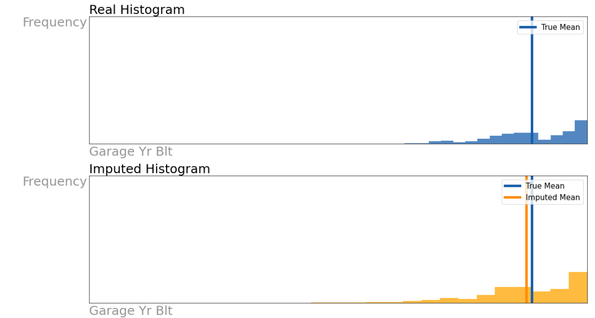

# Getting Ahead of the Market: Modeling Ames estate sale price based on different house features available.
## Content
- [Problem Statement](#Problem-Statement)
- [Background Information](#Background-Information)
- [Methodology](#Methodology)
- [Datasets](#Datasets)
- [Significant Findings](#Significant-Findings)
- [Conclusion](#Conclusion)
- [Recommendations](#Recommendations)
- [Citations and Sources](#Citations-and-Sources)

---

## Problem Statement
As data scientists engaged by Propnex, we are tasked to develop an accurate model to predict house sales in Ames, Lowas based on the given fixed house characteristics. We will approach this analysis by first modeling the sales prices of houses with default features from the dataset, and later performing features selection to optimize the model performance.

---
## Background Information
Many real estate organizations have traditionally relied on a mix of intuition and traditional, retrospective statistics to make pricing decisions ([*source1*](https://www.mckinsey.com/industries/real-estate/our-insights/getting-ahead-of-the-market-how-big-data-is-transforming-real-estate)). Today, a slew of new variables, such as proximity to points of interest and the existence of environmental pollution, allow for more vivid depictions of a location's future risks and benefits ([*source2*](([*source1*](https://www.mckinsey.com/industries/real-estate/our-insights/getting-ahead-of-the-market-how-big-data-is-transforming-real-estate)))).

The sweet spot between density and proximity to community amenities differs by American city and even neighborhood, hidden by an ever-increasing amount of data that is becoming increasingly difficult to manage. For instance, while the impact of the proximity of places of interest on property price is obvious, housing values are also influenced by the number, mix, and quality of community amenities that surround them ([*source1*](https://www.mckinsey.com/industries/real-estate/our-insights/getting-ahead-of-the-market-how-big-data-is-transforming-real-estate)).

These nonlinear interactions can be found in a variety of American cities. Thus, machine learning techniques is one way to stitch together these data through sophisticated analytics, making it substantially easier to comprehend complex relationships.

A successful data-driven approach can yield powerful insights. In this study, we will attempt to develop an accurate and reliable machine-learning model to forecast the house price in Ames, Lowas based on the given fixed house characteristics

---
## Methodology
Following Blitzstein & Pfister’s workflow ([*source3*](https://github.com/cs109/2015/blob/master/Lectures/01-Introduction.pdf)), a 5 steps framework was implemented to conduct this analysis. These 5 steps are:

**Step 1: Ask an interesting question**
- Defining a clear and concise problem statement.

**Step 2: Get the data**
- Import and clean raw data to ensure that all datatypes were accurate and any other errors were fixed.
- Exploring best method to fill up null values, if applicable

**Step 3: Explore the data**
- Differentiate numerical and categorical features in the dataset
- For categorical features, analyze if they are nominal or ordinal features
- Transform ordinal features to numerical ranks
- Perform exploratory data analysis to determine any meaningful correlations
- Dealing with outliers
- Perform feature engineering

**Step 4: Model the data**
- Creating a base model with Linear Regression
- Perform feature selections/ feature engineering to optimize model performance
- Selecting the best Machine learning algorithm/model selection for submission
- Data Visualization
  - subplots
  - histograms
  - scatterplots
  - boxplots

**Step 5: Communicate and visualize the results**
- Present findings to a non-technical audience and provide recommendations

---
## Datasets

* [`train.csv`](./data/act_2017.csv): Data set contains information from the Ames Assessor’s Office used in computing assessed values for individual residential properties sold in Ames, IA from 2006 to 2010. This is the training dataset that includes the housing sale price.
* [`test.csv`](./data/act_2018.csv): Similar as above, but this is the testing dataset that excludes the housing sale price.

---

## Significant Findings

#### About the Dataset
- It is observed that there are both numerical (continuous and discrete) and categorical (nominal and ordinal) features in our dataset, as such there is a need to split and categorized the dataset.
- The NA values reflected in the categorical features mostly represent the lack of house feature rather than a null/blank value. Therefore, it is also important to differentiate between NaN (Blank) vs NA data for categorical features.
- Missing data are also observed for numerical data.
- Some outliers are also seen in our dependent variable, with max at 600k while the interquartile range for 50% and 75% at 162.5k and 214k respectively.

#### Dealing with NaN values in Categorical Features
- Training Dataset

- Testing Dataset

- There are not many blank values (mostly <~1%) and for this analysis, we will be assuming NaN values represent the lack of feature. Replaced NaN values as either ‘None’ or ‘NA’ dependent on the categorical feature unique choices.
- After cleaning up most of the categorical features, 1 more categorical feature (Electrical) have 1 blank value. We further examine the correlation it has with the dependent variable (SalePrice) in the training dataset via boxplot.

- After analysis via boxplot, looks like electrical does not have that much impact on the sale price unless the electrical system is SBrkr type. For this analysis, we will fill in the nan value of the test data with mode() method based on the training dataset.

#### Dealing with NaN values in Numerical Features
- Training Dataset

- Testing Dataset

- For this analysis, we will fill in the numeric features with less than 1.5% of missing data with mean value, linear regression to fill in the nan values for 'Garage Yr Blt' feature, and mean value to fill in nan values for  'Lot Frontage' feature.
- Utilizing the ‘LinearRegression’ strategy from SimpleImputer to fill in the ‘Garage Yr Blt’ Feature in the test dataset.

- Utilizing the ‘mean’ strategy from SimpleImputer to fill in ‘Lot Frontage’ Feature in the test dataset.

#### Data Transformation
**Ordinal Features**
- There are 23 ordinal features in both training and testing datasets, all of which are ranked numerically; with the worst rating always starting from 0.
- After boxplot analysis of ordinal features VS Sale price, we make a bold assumption that some of the ordinal categoricals are equally space, and will not be needed for get_dummies operation

**Nominal Features**
- Before performing get dummies, we noticed 2 nominal features (‘Neighbourhood’ and ‘MS Subclass’) that have many dummies columns which may contribute to the overfit during modeling. We further examine the correlation it has with the dependent variable (SalePrice) in the training dataset via boxplot.
- Neighborhood

- MS Subclass

- After analysis, we converted both ‘Neighbourhood’ and ‘MS Subclass’ to ordinal features to reduce the chance of overfitting, ranking the feature according to the feature median price, 3 being Excellent (>75% of the sale price), 2 being Good (50% to 75% of the sale price), 1 being Fair (25% to 50% of the sale price), 0 being Cheap (<25% of the sale price).

**Outliers**
- The housing price is a right-skewed histogram, indicating that the data contained a lot of outliers with extremely high prices.

- We identified the top 3 features that are highly correlated to the sale price. They are ‘Gr Liv Area’, ‘Garage Area’, ‘Total Bsmt SF. All 3 features also follow the pattern of a right-skewed histogram, indicating that the data contained a lot of outliers with extremely high values.
- After removing the outliers with 3 STD away from the mean values, the histogram of the 3 features definitely appeared more symmetrical, with less extreme values.

- We further performed a natural log-transformation of “SalePrice” to make it look more evenly distributed.

#### Creating a Base Model with LinearRegression

- After performing train-test-split on our training dataset, it is obvious our base model is overfitted, with a high R2 and low RMSE for training data, but negative R2 (indicating it perform worse than the null model) and extremely high RMSE for testing data. Variance chart for testing data set also shows very high residuals for all predicted prices.

#### Feature Engineering
Method 1: Feature Selection based on corr() to the sales price
- 18 features with a minimum threshold of +/- 0.5 correlation score with the sale price

Method 2: Feature Selection based on Lasso regression
- 50 unique features extracted with minimum threshold coeff of +/- 0.005 score with the dependent variable

Method 3: Hybrid - Identifying Features from Lasso regression & Corr()
- 56 unique features extracted from the hybrid method

#### Selecting the Best Model
- For this analysis, we shall use the Lasso method from Method 3 to predict our house price in our test data.

#### More Feature Engineering.
Method 4: Removing colinear features
- For this analysis we dropped 'Garage Cars', 'Garage Yr Blt','1st Flr SF','Exter Qual Rank_3

#### Final Model
Removing collinear features doesn't have much impact on metrics for the training dataset, but since it is considered good practice, we shall stick to it

---
## Conclusion
- Using our base model as the baseline, we have make significant improvement in terms of metrics (R2 and RMSE) for our testing dataset with regularization and features selections.

- We have successfully completed project 2 and developed a lassoCV model that has a decent Kaggle score to predict the housing price in Ames Estate.

- From the lasso coefficient and statistical significant analysis, we observed having an excellent rating for exterior quality adds the most value to the property (41,058.73 dollars). A strong preference for brick common on the exterior covering of the house is also observed, adding 15,360.11 dollars to the house value. Aside from the exterior quality of the house, having an excellent rank for Bsmt Quality helped to add 27,702.84 dollars to the house value

- Conversely, having a Mansard Roof Style depreciates a home's value by 28,555.19 dollars. Thus, it is best to remove/revamp this feature if it makes financial sense before selling the house.

- The median prices in   
       ['StoneBr','NridgHt','NoRidge','GrnHill','Veenker','ClearCr','Somerst','Timber']
are at least 75 percent of the interquartile range of the sale prices. Finding property for less than market value might be a solid investment idea.

- The final model (Kaggle Private leaderboard: 20137.61749 ) have the following 52 features:

        ['Year Remod/Add', 'Roof Style_Mansard', 'Central Air_Y',
       'BsmtFin Type 1 Rank_1', 'Full Bath', 'Overall Cond_2',
       'Garage Finish Rank', 'Screen Porch', 'Overall Cond_4', 'Heating_Grav',
       'MS Zoning_C (all)', 'Gr Liv Area', 'Neighborhood', 'Paved Drive Rank',
       'Kitchen Qual Rank', 'Bsmt Exposure Rank', 'Garage Area',
       'Condition 1_Norm', 'Condition 1_PosA', 'Overall Cond_5',
       'Fireplace Qu Rank', 'Heating QC Rank', 'Total Bsmt SF',
       'Bldg Type_Twnhs', 'Garage Cond Rank_2', 'Land Contour_HLS',
       'BsmtFin SF 1', 'Exter Cond Rank', 'Sale Type_Oth', 'Wood Deck SF',
       'Bsmt Cond Rank', 'Year Built', 'MS Zoning_FV', 'MS Zoning_RL',
       'Sale Type_New', 'Foundation_PConc', 'Garage Cond Rank_1',
       'Overall Cond_3', 'Functional Rank_7', 'Bsmt Full Bath', 'Heating_Wall',
       'Lot Area', 'Bsmt Qual Rank_5', 'Overall Qual', 'Garage Cond Rank_3',
       'Exter Qual Rank_4', 'Exterior 1st_BrkFace', 'Functional Rank_1',
       'Lot Frontage', 'Overall Cond_7', 'Functional Rank_2',
       'Exter Qual Rank_5']

- Our Kaggle score (Private leaderboard: 20137.61749) is slightly better after we removed colinear features. This is compared to Kaggle score of 20196.982 for the private leaderboard before we removed colinear features. Therefore, our approach to removing the colinear features was the right move, and even though the improvement wasn't shown in the training dataset, it have an impact on the metrics of the testing dataset.

---

## Recommendations

- Use dimension reduction algorithms such as Principle Component Analysis (PCA) to take care of multi collinear features instead.
- Utilize other ML methods such as gradient boosting to check for improvement of performance.
- Considering reducing the number of columns (original 17) in nominal 'Exterior 1' feature by studying the correlation it has with the house sale and converting them to ordinal feature instead.
- Check for outliers among the 40 selected features for the final model.

---
## Citation and Sources
The sources used in this analysis:
- Source1: https://www.mckinsey.com/industries/real-estate/our-insights/getting-ahead-of-the-market-how-big-data-is-transforming-real-estate
- source2: https://www.redirectconsulting.com/blog/big-data-in-real-estate-3-important-non-traditional-data-sets-to-consider
- source3: https://github.com/cs109/2015/blob/master/Lectures/01-Introduction.pdf
- source4: http://jse.amstat.org/v19n3/decock/DataDocumentation.txt
