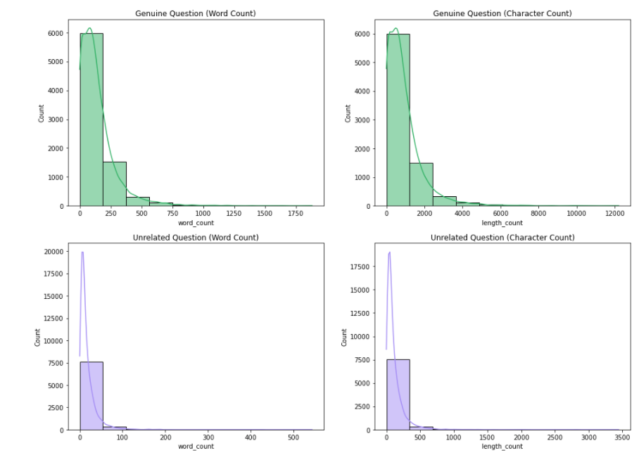
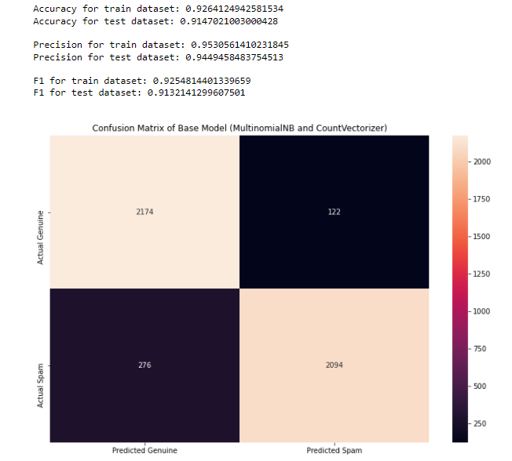
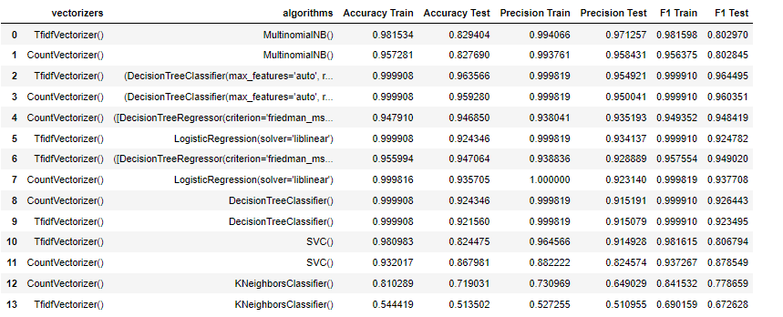
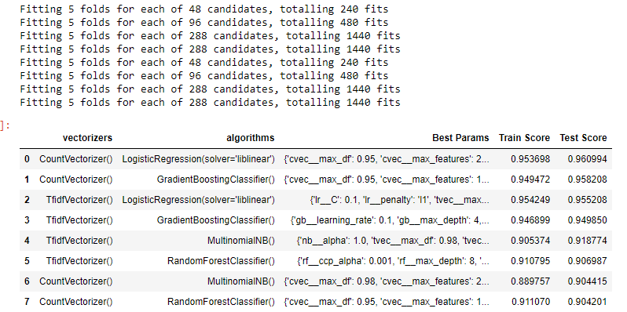
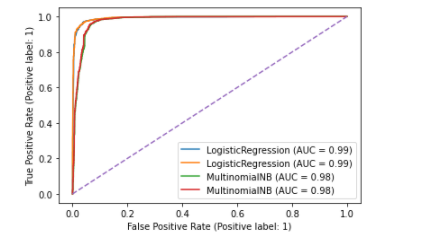
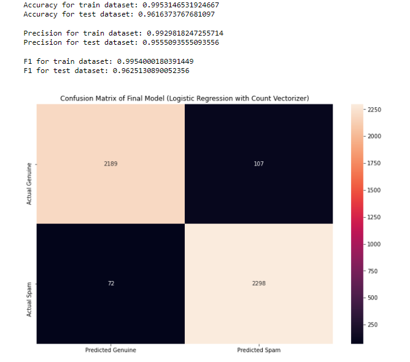
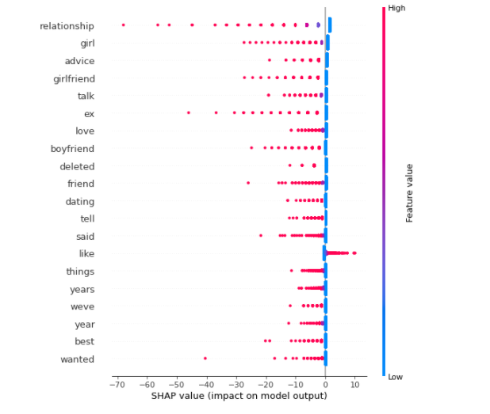
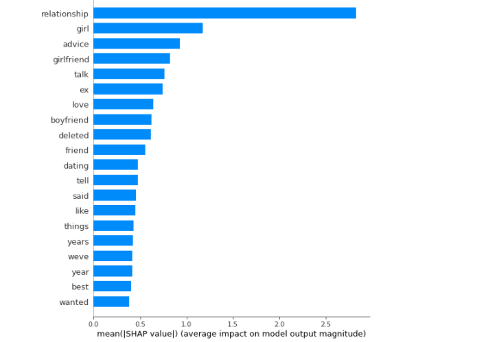
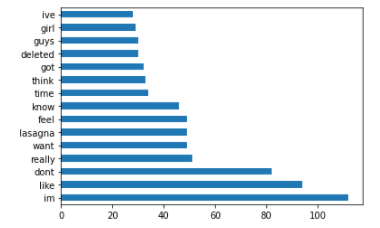

# Project 3: Binary CLassification of Subreddit Posts
## Content

- [Problem Statement](#Problem-Statement)
- [Executive Summary](#Executive-Summary)
- [Methodology](#Methodology)
- [Datasets](#Datasets)
- [Summary of Datascience Process](#Summary-of-Datascience-Process)
- [Conclusion & Recommendations](#Conclusion-&-Recommendations)
- [Citations and Sources](#Citations-and-Sources)

---

## Problem Statement
We've been tasked by a matchmaker company (Swindler Inc) to construct a binary classification model that can distinguish genuine relationship advice questions (subreddit r/relationship advise) from potential spam and non-related enquiries (subreddit r/stupidquestions). Seven classification models will be created for this project: Naive Bayes, Logistic Regression, Random Forest, Decision Tree, K-Nearest Neighbors, Support Vector Machines and Gradient Boosting with accuracy, precision and F1 score on unseen test data used to determine success. Swindler Inc. relationship experts will be key stakeholders in the endeavor. The intention for this study is for relationship specialists to spend as little time as possible reviewing emails in order to determine which are spam. The time saved can then be put to better use, such as increasing production or providing clients with more specialized relationship guidance.

---
## Executive Summary
Working professionals who don't have enough time to meet people in real life owing to their tight work schedule are increasingly using Swindler dating app. It not only makes dating easy and comfortable for working professionals, but it also provides customized relationship advice. However, Swindler dating app receives a flood of inquiries for advises on a daily basis, and they fear that some of these inquiries are the result of foul play by competitors.

As such, they've enlisted the expertise of well-known NLP experts to develop a binary classification model that can tell the difference between genuine relationship guidance enquiries and non-related inquiries. NLP experts advocate collecting data from Reddit, a social news network that allows users to discuss and vote on articles published by other users, in order to train a suitable model. The model will be developed using the following two Reddit threads: genuine relationship inquiries from r/relationship advise and unrelated questions from r/stupidquestion.

Seven classification models were developed for this binary classification project: Naive Bayes, Logistic Regression, Random Forest, Decision Tree, K-Nearest Neighbors, Support Vector Machines and Gradient Boosting with accuracy, precision and F1 score on unseen test data used to determine success.

When it comes to training and testing gridsearch metric scores, both the Logistic and GradientBoostingClassifier models perform equally well after hyperparameter adjustment. However, because it is the simplest/easiest model for the audience to understand, we used the logistic regression model with countvectorizer as our final model in this study. On our testing dataset, it has the greatest accuracy of 0.96161, precision of 0.9555, and F1 score of 0.9621. However, there is still some overfitting between the training and test datasets.

As such, moving forward, some recommendations to further improve the model as follows:
- Use the latest classification modeling technique such as catboost to check for improvement of performance
- Conduct lemmatization for both topics
- Perform Sentiment analysis of the 2 topics and observed for obvious differences
- Expand STOPWORDS library to include most frequently misclassified words
- Perform gridsearch for all 7 classification models

---
## Methodology
Following Blitzstein & Pfister’s workflow ([*source3*](https://github.com/cs109/2015/blob/master/Lectures/01-Introduction.pdf)), a 5 steps framework was implemented to conduct this analysis. These 5 steps are:

**Step 1: Ask an interesting question**
- Defining a clear and concise problem statement.

**Step 2: Get the data**
- Import and clean raw data to ensure that all datatypes were accurate and any other errors were fixed.

**Step 3: Explore the data**
- Check for duplicated posts for each topic
- Plot visualization for distribution of posts of each topic
- Feature engineering
- Remove URLS / punctuations / NON-ASCII / Stopwords for each posts

**Step 4: Model the data**
- Creating a base model with MultinomialNB model
- Compare success metrics between the different classification models after hyperparameters tuning
- Selecting the best Machine learning algorithm/model selection for submission
- Data Visualization
  - barplots
  - histograms
  - SHAP summary plot

**Step 5: Communicate and visualize the results**
- Present findings to a non-technical audience and provide recommendations

---
## Datasets

* [`genuine_question.csv`](../datasets/genuine_qns.csv): Data set contains genuine relationship questions. This dataset will be split for  training and testing purposes.
* [`unrelated_question.csv`](../datasets/unrelated_qns.csv): Data set contains unrelated questions. This dataset will be split for  training and testing purposes.

---

## Summary of Datascience Process

#### Data Collection
- We have successfully scrapped 8000 posts each from subreddits r/relationship_advise r/stupidquestions via Pushshift API to develop an accurate binary classification model that can distinguish genuine relationships advice questions (subreddit r/relationship advise) from potential spam and non-related enquiries (subreddit r/stupidquestions).

#### Exploratory Data Analysis (EDA)
- Map genuine questions column as 0 and spam/non-related enquiries as 1 since it's a binary classification problem
- Removing duplicated posts for both topics before modeling
- Creating a custom function to remove the following from each post:
   - Remove deleted posts
   - Remove URLs
   - Remove punctuations
   - Remove Non-ASCII characters
   - Remove raw text of comments and submission self texts
   - Remove stopwords
- Feature engineering
   - Created 2 features, namely "word_count" and "length count" to visualize the distribution of post lengths and word counts

   - The distribution plots are right-skewed and show a fair amount of out liers, however we did not remove them as it may impact model performance.
- Explore most frequent words with Count Vectorization and TfidfVectorizer for both topics
- Although the top 15 terms for each topic are mainly similar in both Count Vectorizer and TFID techniques, words like 'im' and'really' appear often in both subreddits, potentially lowering the performance of our model. As a result, hyperparameter tuning of parameters (ngram range, max features, max df, min df, and so on) is required at a later stage.

#### Modeling
- Base Model
  - When compared to genuine relationship queries, unrelated questions have slightly more postings (50.8%), hence it is crucial to stratify during train_test_split. Although this can be considered the null model, with a baseline accuracy of 50.8 percent in identifying non-related enquiries,  we have instead created the null model using the Count Vectorizer and MultinomialNB technique.
    
  - With the accuracy, precision, and F1 score higher for our training dataset as compared to the testing dataset, it is observed there may be some overfitting issue.
- Going back a step, why were precision and F1 score chosen as the criteria to determine model performance?
  - In the classification of Reddit topics, it is okay if any unrelated questions remain undetected (false negative), but we do not want to miss any critical relationship inquiries because it is classified as spam (false positive). False Positives should be kept to a minimum in this case. Precision is more important than recollection in this situation.
  - With that in mind, we utilized the F1 score (weighted average of Precision and Recall) as our metric to account for recall score during modeling.
- Evaluating Other Models Performance without GridSearchCV

   - Based on training metric-score and testing metric-scores (Precision, F1, and Accuracy), all models show signs of overfitting with the exception of the GradientBoostingClassifier model.
   - The top 4 models based on the chosen metrics are GradientBoostingClassifier, RandomForestClassifier, MultinomialNB and LogisticRegression
- Hyperparameters Tuning

    - Both the Logistic and GradientBoostingClassifier models show equal performance when it comes to training and testing gridsearch metric scores. We will use the logistic regression model with countvectorizer as our final model in this study because it is the simplest/easier model for the audience to understand.
- Visualizing ROC Curve
    - We have plotted ROC curves for Simpler Models i.e. Logistic Regression and MultinomialNB models
    
    - The area under the curve (AUC) for LogisticRegression > AUC for MultinomialNB, suggests that the LogisticRegression model is better suited for this classification study.
    - Recall earlier, one of our main goals for this study is to minimize the false positive rate (optimizing the precision score), Logistic Regression has evidently less false positive rate compared to the MultinomialNB model.

#### Evaluating Final Model
- Compared to Base Model

    - All 3 metrics (Accuracy,Precision and F1 scores) for our final model built with Logistic Regression improved after hyperparameters tuning.
    - The base Model Accuracy for test score was 0.9147, improved to 0.9616 with our final model
    - The base Model Precision for test score was 0.9449, improved to 0.9555 with our final model
    - Base Model F1 for test score was 0.9132, improved to 0.9621 with our final model
    - However, some overfitting is still observed between the training and test datasets
- Model Interpretation
    - We used a density scatter plot of SHAP values (source1) for each feature to determine how much impact each feature has on the model output for the classification of 2 subreddits. The total of the SHAP value magnitudes across all samples is used to order features.
    
- The Summary Plot demonstrates the following information:
    - 1) Feature importance: Variables are ranked in descending order.
    - 2) Impact: The horizontal location shows whether the effect of that value is associated with a positive or negative impact.
    - 3) Original value: Color shows whether that variable is high (in red) or low (in blue) for that observation.
    - From both the summary plots, we can deduce that the top feature importance words contribute to the negative class #0 (genuine questions). This result is expected since the top feature importance words are mostly related to relationships which we have classified as a negative class earlier on (#0).
- Summary Bar Plot
    - The Summary Bar plots the most significant variables in descending order. The top variables contribute more to the model than the bottom ones and thus have high predictive power.
    

---
## Conclusion & Recommendations
**Going back to our problem statement...**

- We have successfully developed a relatively accurate binary classification model that can distinguish genuine relationship advice questions (subreddit r/relationship advise) from potential spam and non-related enquiries (subreddit r/stupidquestions).

- 7 Classification Models were initially developed and compared using Accuracy, Precision, and F1 score as our metrics. After hyperparameters tuning, both the Logistic and GradientBoostingClassifier models show equal performance when it comes to training and testing gridsearch metric scores. However, We used the logistic regression model with countvectorizer as our final model in this study because it is the simplest/easier model for the audience to understand.

- Compared to our base model (MultinomialNB + count vectorizer), we have made a significant improvement with our final model in terms of the 3 metrics (Accuracy, Precision, and F1) for our testing dataset with gridsearchCV.

- Using SHAP library, we can deduce that the top feature importance words that contribute to our model:
    - From our final model (n-gram = 1,3) the top 5 contributor words are ['relationship','girl','advice','girlfriend','talk'].
    - With Tri-gram in our count vectorizer, the top 5 contributor words are ['long distance relationship','feel like im','feel like good','dont know start','long story short'].

- We have also identified the top 15 terms that appear most frequently in misclassified posts with our model. We could potentially include these words as 'STOPWORDS' to improve our model's performance

**Recommendations**
- Use the latest classification modeling technique such as catboost to check for improvement of performance
- Conduct lemmatization for both topics
- Perform Sentiment analysis of the 2 topics and observed for obvious differences
- Expand STOPWORDS library to include most frequently misclassified words
- Perform Gridsearch on all 7 classification models
---
## Citation and Sources
The sources used in this analysis:
- Source1: https://towardsdatascience.com/explain-your-model-with-the-shap-values-bc36aac4de3d
