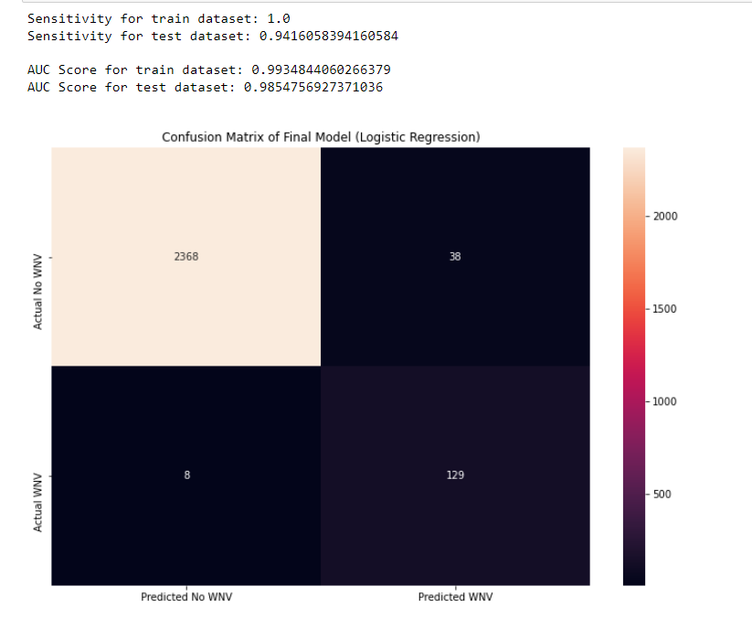

# Project 4: West Nile Virus Classification
## Content

- [Problem Statement](#Problem-Statement)
- [Executive Summary](#Executive-Summary)
- [Folder Organisation](#Folder-Organisation)
- [Datasets](#Datasets)
- [Conclusion & Recommendations](#Conclusion-&-Recommendations)
- [Citations and Sources](#Citations-and-Sources)

---

## Problem Statement
The Chicago Department of Public Health (CDPH) has set up a surveillance and control system to catch mosquitos and test for the presence of WNV in the aftermath of the city's recent WNV outbreak. The purpose of this study is to use surveillance data to forecast WNV outbreaks based on date, location, mosquito type, and weather characteristics. The findings of this study will be utilized to improve resource allocation and effectively prevent the spread of this potentially deadly infection. Success is defined as the final model's capacity to offer a sufficiently high level of classification accuracy based on the following two measures:

- Sensitivity: Refers to the true positive rate and summarizes how well the positive class (WnvPresnet) is predicted, particularly useful metric for imabalance classification dataset

- AUC ROC score: The Area Under the Curve (AUC) - ROC curve is a performance statistic for classification issues at various threshold levels. AUC represents the degree or measure of separability, whereas ROC is a probability curve. It indicates how well the model can distinguish between classes. The AUC indicates how well the model predicts the different classes. The higher the AUC, the better the model predicts the negative and positive classes.

---
## Executive Summary
The mosquito-borne zoonotic illness West Nile virus (WNV) was first discovered in the United States in New York City in the summer of 1999. WNV swiftly adapted to local populations of Culex vector mosquitoes and bird populations after its first successful invasion in New York, and it soon expanded across the United States ([*source1*](https://www.cdc.gov/mmwr/preview/mmwrhtml/ss5902a1.htm)).

While WNV is not particularly virulent, with only around 1 in every 150 people infected developing West Nile fever and its symptoms, it is a severe and sometimes fatal disease (CDC, 2009). There is no vaccine available to protect against WNV at this time.

A well-executed data-driven strategy can generate detailed insights. In this study, we will attempt to develop an accurate and reliable machine-learning model using classification modeling techniques to improve resource allocation and effectively prevent the spread of this potentially deadly infection.

Six classification models were developed for this binary classification project: Logistic Regression, Random Forest, Decision Tree, K-Nearest Neighbors, Support Vector Machines and Gradient Boosting with sensitivity and AUC score used to determine success.

After hyperparameter tuning, both the Logistic and SVC models perform equally well when it comes to training and testing gridsearch metric scores. However, we picked the logistic regression model as our final model in this study because it is the simplest/easiest model for the audience to understand.

Moving forward, recommendation to improve the model as follows:
- Due to a lack of spraying data, drawing any conclusions on the efficiency of pesticide spray in reducing mosquito populations is difficult. To better understand the effect of pesticide on mosquitoes and investigate the effective time of the spray, it is recommended that spraying begin in early summer and continue until late July/early August, when the number of mosquitoes normally peaks.

---

## Folder Organisation
---
    |__ charts
    |   |__ final_model.png
    |   |__ summary_plot.png
    |   |__ workflow.png
    |   |__ chicago_wnv_cases.png
    |__ code
    |   |__ Project4-Part1(EDA).ipynb   
    |   |__ Project4-Part2(Modeling).ipynb     
    |__ datasets
    |____ cleaned
    |    |____ combined_test_df.csv
    |    |____ combined_train_df.csv
    |    |____ cleaned_spray.csv    
    |    |____ cleaned_weather.csv
    |    |____ kaggle_submission.csv
    |____ raw
    |    |____ train.csv
    |    |____ test.csv
    |    |____ spray.csv    
    |    |____ weather.csv
    |    |____ mapdata_copyright_openstreetmap_contributors.txt
    |__ README.md

---
## Datasets

* [`train.csv, test.csv`](../datasets/raw/train.csv):  the training and test set of the main dataset. The training set consists of data from 2007, 2009, 2011, and 2013, while in the test set you are requested to predict the test results for 2008, 2010, 2012, and 2014.
    - Id: the id of the record
    - Date: date that the WNV test is performed
    - Address: approximate address of the location of trap. This is used to send to the GeoCoder.
    - Species: the species of mosquitos
    - Block: block number of address
    - Street: street name
    - Trap: Id of the trap
    - AddressNumberAndStreet: approximate address returned from GeoCoder
    - Latitude, Longitude: Latitude and Longitude returned from GeoCoder
    - AddressAccuracy: accuracy returned from GeoCoder
    - NumMosquitos: number of mosquitoes caught in this trap
    - WnvPresent: whether West Nile Virus was present in these mosquitos. 1 means WNV is present, and 0 means not present.

* [`spray.csv`](../datasets/raw/spray.csv): GIS data of spraying efforts in 2011 and 2013
    - Date, Time: the date and time of the spray
    - Latitude, Longitude: the Latitude and Longitude of the spray

* [`weather.csv`](../datasets/raw/weather.csv): weather data from 2007 to 2014. Column descriptions in noaa_weather_qclcd_documentation.pdf.

---

## Conclusion & Recommendations
**Findings from our model:**
- Using Logistic Regression as our final model, we achieved an ROC_AUC of 0.9855 and sensitivity score of 0.9416, with the following confusion matrix:

- From both the summary plots, it is observed the top features are mostly related to weather parameters. More WNV are present if humidity and weather temperature are high. Interestingly, the opposite is true for windspeed; meaning to say there are fewer incidences of WNV when there is a high windspeed.

- We also discovered that WNV is more likely to occur during specific weeks of the year, and that spraying efforts should be concentrated during these weeks.
- Our model also discovered that location is not a major predictor of WNV detection, implying that mosquitoes could breed anywhere with favorable weather/environmental conditions.
- Particular mosquito breeds (pipens/restuans species) are more susceptible to WNV infection.

**Recommendations**
- Due to a lack of spraying data, drawing any conclusions on the efficiency of pesticide spray in reducing mosquito populations is difficult. To better understand the effect of pesticide on mosquitoes and investigate the effective time of the spray, it is recommended that spraying begin in early summer and continue until late July/early August, when the number of mosquitoes normally peaks.
---

## Citations and Sources
The sources used in this analysis:
- Source1: https://www.cdc.gov/mmwr/preview/mmwrhtml/ss5902a1.htm
