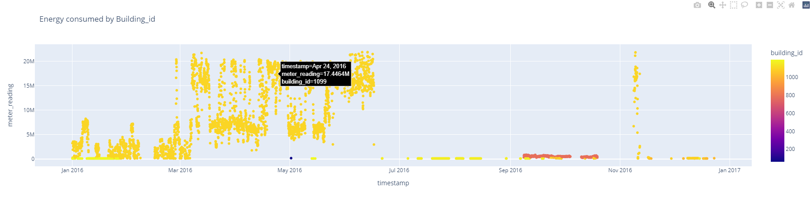

# Final Capstone: ASHRAE - Great Energy Predictor III (LGBM AND RNN  Models)
## Content

- [Problem Statement](#Problem-Statement)
- [Background Information](#Background-Information)
- [Folder Organisation](#Folder-Organisation)
- [System Setup](#System-Setup)
- [Datasets](#Datasets)
- [Significant Findings and Recommendations](#Significant-Findings-and-Recommendations)
- [Citations and Sources](#Citations-and-Sources)

---

## Problem Statement
The Great Energy Predictor III from ASHRAE aims to develop counterfactual models for predicting energy across four energy types (electricity, chilledwater, steam, hotwater) based on historic usage rates and observed weather. Energy savings can then calculated by computing the new energy consumption after retrofit to the old building's modeled values. Findings of this study will be used to improve estimations of these energy-saving initiatives, allowing large-scale investors and financial institutions to be more willing to invest in building efficiencies.

The datasets contain 2,380 hourly energy meter readings from 1,448 buildings in 16 distinct locations throughout the world, with a total of 20 million observations (2016) in the train dataset and 41 million in the test dataset (2017-2019). The evaluation metric for this study will be Root Mean Squared Logarithmic Error (RMSLE), which is robust to outliers.

---

## Background Information
In the early days of artificial intelligence research for buildings, the Great Energy Predictor I and II contests paved the way for data-driven building energy prediction innovation. Many new ideas, tools, and data sources have emerged in the more over two decades after those early challenges, resulting in significantly more extensive datasets, which were the spark for the competition's revival. The goal of ASHRAE Great Energy Predictor III is to find the most effective data-driven building energy prediction techniques. The main technical goal was to figure out which model types, machine learning methods, and workflows worked best for this particular application of long-term meter prediction.

In this project, we will approach this energy forecasting problem as a regression problem, and develop Decision Tree Ensemble models and Gated recurrent unit (GRUs) models for each meter type that strikes the right balance in the bias-variance trade off.

Beyond technical considerations, the competition's primary goal was to bring the data science and building science communities closer together through the interchange of thoughts, terminologies, and approaches, according to the planning team. Building energy analysts often only employed the most basic machine learning techniques, while machine learning professionals knew little about buildings. The intention was for this competition to serve as a catalyst for post-competition exchange ([*source1*](https://www.ashrae.org/news/ashraejournal/searching-for-the-best-data-driven-energy-prediction-techniques)).

---

## Folder Organisation

    |__ charts
    |   |__before_log_transformed_target.png
    |   |__building1099.png
    |   |__facilities_meter_readings.png
    |   |__feature-importance.png
    |   |__heatmap.png
    |   |__log_transformed_target.png
    |   |__meter_type_readings.png
    |   |__overall_readings.png
    |   |__site_meter_readings.png
    |   |__weather_meter_readings.png
    |__ code
    |   |__ Project5-Part1(EDA).ipynb   
    |   |__ Project5-Part2(Cleaning).ipynb
    |   |__ Project5-Part3A(Modeling).ipynb
    |   |__ Project5-Part3B(Modeling&Ensembling).ipynb     
    |__ README.md
    |__ requirements.txt
    
PS: If you're having trouble viewing the EDA jupyter notebook (Title "Project5-Part1(EDA).ipynb") on Github, try this ([*LINK*](https://nbviewer.org/github/Jiasheng30/General-Assembly-Projects/blob/master/project_5/code/Project5-Part1%20%28EDA%29.ipynb)).

Datasets available at this ([*LINK*](https://drive.google.com/drive/folders/1tR2j9VFb1QEncYgenRzx-wmk5mkxGYfe?usp=sharing )) in Google Drive. 

---

## System Setup
The hardware characteristics of the machine on which this solution was replicated are listed below.

The system's hardware specifications are as follows:

- AWS EC2 is a cloud computing service provided by Amazon Web Services.

- m5a.4xlarge is the instance type (16 vCPUs, 64 GB RAM, and EBS)

- SSD Volume Type AMI: Ubuntu Server 22.04 LTS (HVM)

- [`requirements.txt`](../requirements.txt) contains versions of modules installed for environment  

---

## Datasets

[`train.csv`](../datasets/raw/train.csv)
- building_id - Foreign key for the building metadata
- meter - The meter id code. Read as {0: electricity, 1: chilledwater, 2: steam, 3: hotwater}. Not every building has all meter types.
- timestamp - When the measurement was taken
- meter_reading - The target variable. Energy consumption in kWh (or equivalent). Note that this is real data with measurement error, which we expect will impose a baseline level of modeling error. UPDATE: as discussed here, the site 0 electric meter readings are in kBTU.

[`building_meta.csv`](../datasets/raw/building_meta.csv)
- site_id - Foreign key for the weather files.
- building_id - Foreign key for training.csv
- primary_use - Indicator of the primary category of activities for the building based on EnergyStar property type definitions
- square_feet - Gross floor area of the building
- year_built - Year building was opened
- floor_count - Number of floors of the building

[`weather_[train/test].csv`](../datasets/raw/weather_[train/test].csv)
Weather data from a meteorological station as close as possible to the site.
- site_id
- air_temperature - Degrees Celsius
- cloud_coverage - Portion of the sky covered in clouds, in oktas
- dew_temperature - Degrees Celsius
- precip_depth_1_hr - Millimeters
- sea_level_pressure - Millibar/hectopascals
- wind_direction - Compass direction (0-360)
- wind_speed - Meters per second

[`test.csv`](../datasets/raw/test.csv)
- row_id - Row id for your submission file
- building_id - Building id code
- meter - The meter id code
- timestamp - Timestamps for the test data period

---

## Significant Findings and Recommendations

**General Findings from EDA**
- There are nearly the same number of normalized observations in the testing dataset VS training dataset, indicating that the variance for the various features is well-represented.

- Building 1099 is a clear anomaly (refer to plot below). Given its GFA, the building is unlikely to consume so much energy. It's possible that the meters aren't working properly or that the meter readings are cumulative.

- It is not surprising for education facility to consume the most energy since building 1099 is such facility (plot below). When classified by site, site 13 spends the most energy (because to building 1099), and when sorted by meter type, meter 2 consumes the most energy (also because of building 1099).

- From 2016 to 2018, we continuously find increased usage throughout the summer (June-Sept) and winter (December-March) seasons based on the Average Air-Temperature VS Meter Reading. The fact that heaters are typically used when temperatures are cold and air conditioners are used when temperatures are hot helps explain this tendency. Both of these factors contribute to increased energy use.

- Using LOFO analysis, the top features (plot below) for our models are square feet, building id, primary use, and building counts per site.

**Significant Findings**:

- In the setting of a large dataset, decision tree ensemble models such as Light Gradient Boosting Trees are an effective and efficient model type for time-series hourly energy regression. Complex models, such as deep learning GRU, are less effective when used alone (especially with missing time sequences), but they can be combined with other models to produce better predictions with smaller generalization errors.

- In this project, we used ensemble models of Light Gradient Boost and Deep Learning GRU in our project to attain a respectable RMSLE score of 1.191 (public board) in the kaggle competition without using any leaked data. When compared to individual model scores, the kaggle score produced from ensemble models is superior.

- Another important discovery was that all machine learning process steps had an effect on model accuracy, as seen in the following examples:

  - With some domain expertise in meters and simple intuition, abnormal readings for the four meters were detected and dropped

  - Additional weather parameters like feels like temperature, wind chill, and heat index have a favorable impact on the model and are acknowledged as key elements in our LOFO analysis.

**Recommendations**

- Developing one model for each building (1449 models in total)
- Developing one model for each site (16 models in total)
- One hot encode building_id and site_id before modeling (computationally expensive)
- Experiment relations of existing features and target variable (prediciting kwh/ft2 instead)
---

## Citations and Sources
The sources used in this analysis:
- Source1: https://www.ashrae.org/news/ashraejournal/searching-for-the-best-data-driven-energy-prediction-techniques
